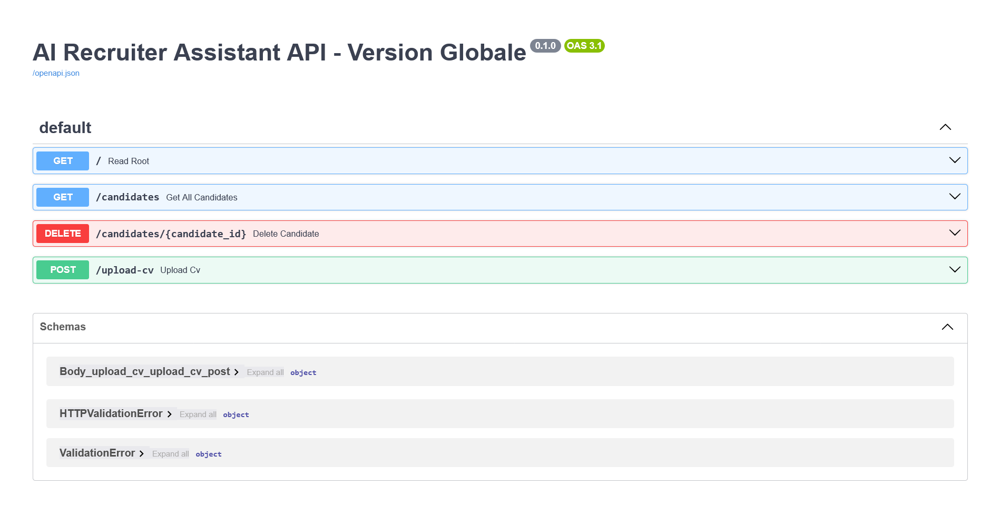
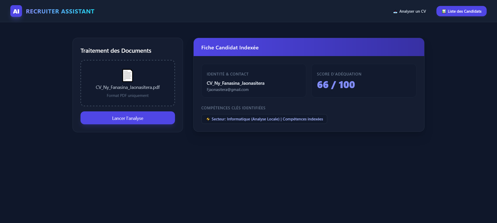
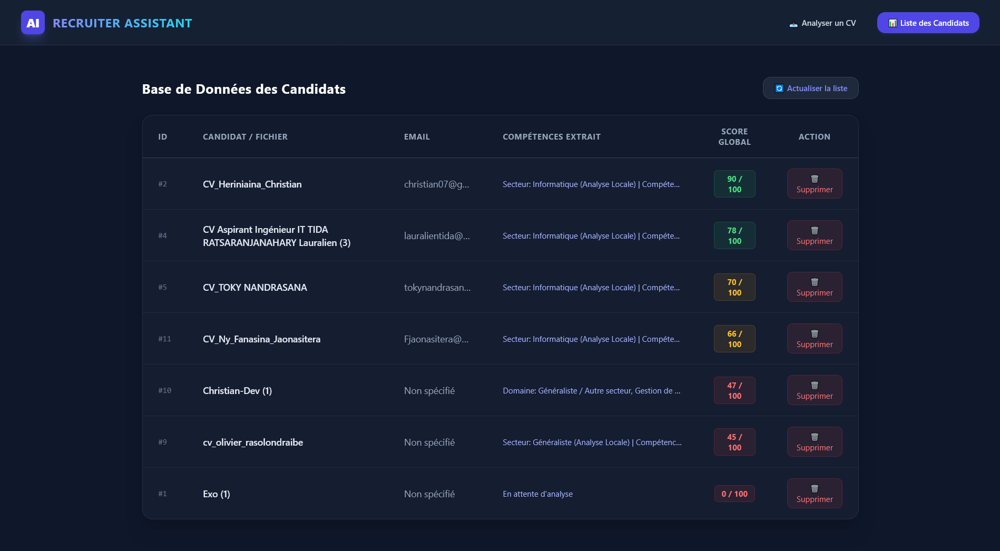
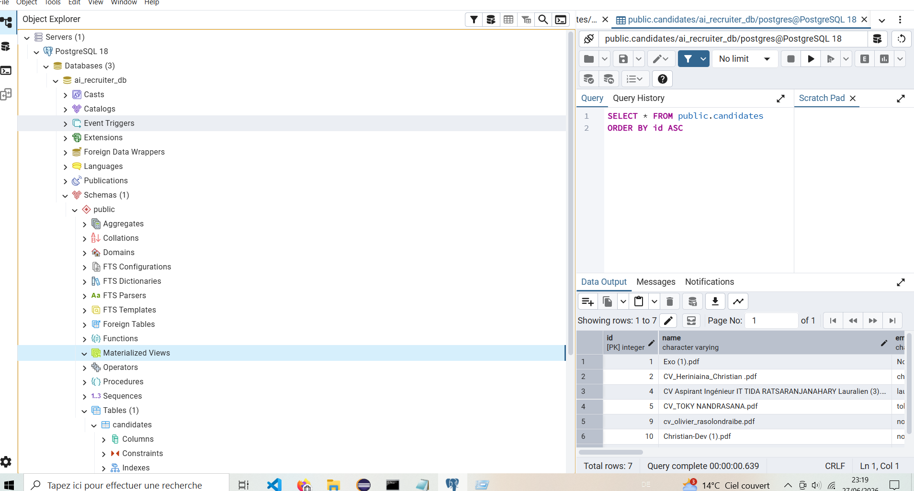

# Assistant Intelligent de Recrutement (AI Recruiter Assistant)

Ce projet de fin d'études de Master 2 consiste en la conception et le développement d'une application web centralisée dédiée à l'automatisation du tri, de l'indexation sémantique et de l'évaluation quantitative de curriculums vitae au format PDF. L'infrastructure repose sur une architecture découplée associant un traitement asynchrone des documents en arrière-plan et une interface d'administration dynamique.

## 🚀 Fonctionnalités Majeures Implémentées

* **Extraction Textuelle Avancée** : Extraction automatisée du contenu brut à partir de documents PDF, incluant un processus de nettoyage strict des flux d'octets et des caractères spéciaux pour sécuriser l'indexation.
* **Analyse Sémantique Universelle** : Analyse contextuelle multi-secteurs (Informatique, Gestion, Électronique, Finance, etc.) permettant d'extraire de manière dynamique les compétences clés d'un profil sans répertoire de mots-clés pré-définis.
* **Algorithme de Scoring d'Adéquation** : Calcul en temps réel d'une note de pertinence sur 100 points, basée sur des critères académiques rigoureux : la densité technique du profil, l'expérience professionnelle et le niveau de diplôme détecté.
* **Gestion et Persistance Relationnelle** : Stockage sécurisé des profils indexés au sein d'une base de données relationnelle, avec un mécanisme natif de résolution des doublons basé sur l'identifiant unique ou le nom du fichier.
* **Tableau de Bord Intégral** : Interface de suivi permettant de lister l'ensemble des candidatures par ordre de pertinence décroissante, d'actualiser les flux de données et de supprimer définitivement des enregistrements.

## 🛠️ Architecture Technique et Écosystème

### Environnement Backend
* **FastAPI** : Framework haute performance pour la construction de l'interface de programmation d'application (API) REST.
* **SQLAlchemy & Psycopg2** : Mapping objet-relationnel (ORM) pour la communication sécurisée et la gestion des transactions avec la base de données.
* **PyPDF** : Moteur d'analyse binaire pour le traitement des fichiers complexes.
* **Modèle linguistique avancé (LLM - Inférence distante)** : Intégration sémantique pour la contextualisation sectorielle des données.

### Environnement Frontend
* **React & Vite** : Bibliothèque d'interface utilisateur et environnement de construction optimisé pour une application monopage (Single Page Application).
* **React Router DOM** : Gestionnaire de routage côté client pour assurer une navigation fluide entre les modules d'analyse et de gestion.
* **Axios** : Client HTTP pour la gestion des requêtes asynchrones et le transfert asynchrone multipartite des fichiers.
* **Tailwind CSS** : Framework de conception graphique utilisé pour le rendu du tableau de bord.

### Infrastructure de Données
* **PostgreSQL & pgAdmin 4** : Système de gestion de base de données relationnelle choisi pour la robustesse de sa persistance et la conformité des contraintes d'intégrité.

## 📂 Organisation du Répertoire du Projet

```text
AI-Recruiter-Assistant/
├── assets/                     # Captures d'écran et documentations visuelles
├── backend/                    # Code source de l'infrastructure logique
│   ├── app/
│   │   ├── database.py         # Configuration et session PostgreSQL
│   │   ├── main.py             # Points d'accès de l'API et algorithmes d'analyse
│   │   └── models.py           # Modèles de données et schémas relationnels
│   └── requirements.txt        # Dépendances du tontolo Python
└── frontend/                   # Interface utilisateur graphique
    ├── src/
    │   ├── pages/
    │   │   ├── DashboardPage.jsx # Tableau récapitulatif et actions de gestion
    │   │   └── UploadPage.jsx    # Zone d'importation et d'analyse immédiate
    │   ├── App.jsx             # Configuration des routes de navigation
    │   ├── index.css           # Directives globales des styles
    │   └── main.jsx            # Point d'entrée de l'application React
    ├── tailwind.config.js      # Configuration de la charte graphique
    └── package.json            # Manifeste des modules Node.js
```

## ⚙️ Protocole d'Installation et d'Exécution Locale

### 1. Initialisation de l'Infrastructure Backend
Se positionner dans le répertoire d'application logique, activer l'environnement virtuel, installer les dépendances nécessaires puis lancer le serveur de développement :
```bash
cd backend
python -m venv venv
# Activation sous Windows (Command Prompt)
venv\Scripts\activate
pip install -r requirements.txt
python -m uvicorn app.main:app --reload
```
*Le point d'accès de l'infrastructure et sa documentation interactive associée sont disponibles à l'adresse suivante : `http://127.0.0`.*

### 2. Initialisation de l'Interface Frontend
Ouvrir un second terminal, naviguer vers le répertoire de présentation graphique, installer l'ensemble des bibliothèques dépendantes puis exécuter le serveur local :
```bash
cd frontend
npm install
npm run dev
```
*L'application web client est accessible en temps réel à l'adresse suivante : `http://localhost:5173/`.*

## 📊 Captures d'Écran et Validation du Système

### 1. Interface de Programmation d'Application (API FastAPI)


### 2. Interface Utilisateur (Analyse Individuelle de CV)


### 3. Tableau de Bord Centralisé (Indexation Globale)


### 4. Persistance Relationnelle des Données (pgAdmin 4)


